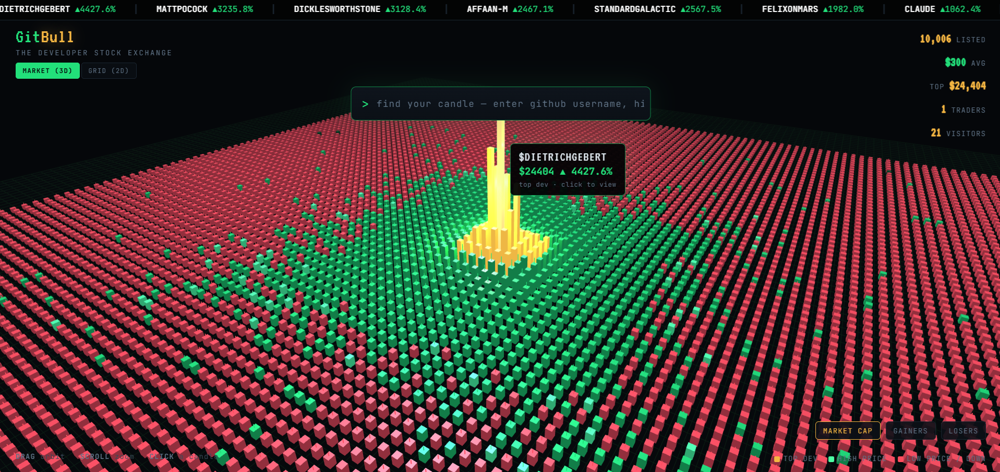
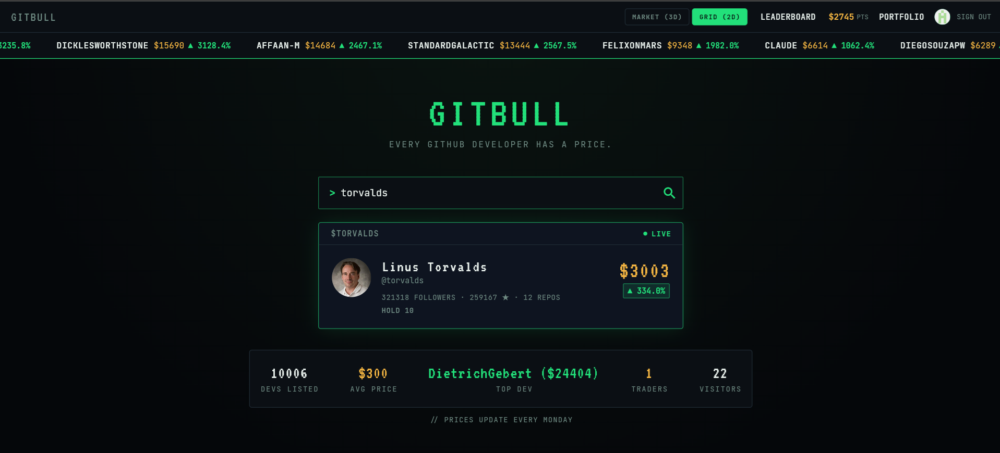
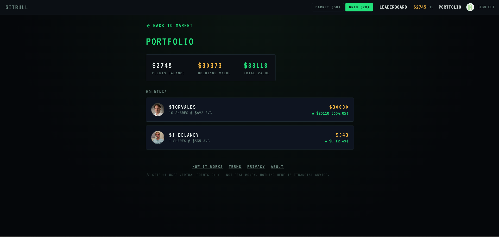

# gitbull-public
# 🐂 GitBull

**The stock exchange for developers.**

Every GitHub developer has a price. GitBull turns your commits, stars, and repos into a living stock market — buy low, sell high, and trade your favorite devs like blue-chip stocks.

**🔗 Live: [gitbull-5bdd5.web.app](https://gitbull-5bdd5.web.app)**

---

## What is GitBull?

GitBull is a fun, virtual stock exchange where the "companies" are GitHub developers instead of businesses. Every dev on GitHub has a stock price derived from their public activity, and you can trade shares of them using virtual points — no real money, just bragging rights and market instincts.

Think Wall Street meets GitHub. Is a prolific open-source maintainer about to have a breakout week? Is a rising star's price about to correct? Build a portfolio, ride the swings, and see who tops the leaderboard.

It's not affiliated with GitHub, it's not real money, and it's not serious — it's a game for people who live in terminals and can't resist a good market simulation.

---

## Key Features

- **🕹️ 3D Candlestick Market** — Fly through a fully interactive 3D market view (built with Three.js) where every candlestick is a developer's stock, rendered in real time.
- **📊 2D Market Grid** — A denser, faster grid view for scanning the whole market, sorting by price, movement, or holdings.
- **📆 Weekly Price Updates** — Prices refresh on a weekly cron cycle, pulling fresh signal from the GitHub API so the market actually moves with real developer activity.
- **💰 Virtual Trading** — Buy and sell dev "stock" using virtual points. No real currency, all the drama.
- **📁 Portfolio Tracking** — See what you hold, what it's worth, and how it's trending.
- **🏆 Leaderboard** — Compete against other players for the best portfolio performance.
- **🔗 Share Sheet** — Share your favorite dev's stock card or your portfolio flex with a clean, social-ready image.

---

## Screenshots

**3D Candlestick Market** — every dot on this field is a real GitHub developer, colored and sized by price and weekly movement.

**Dev Card (2D Grid)** — search any GitHub username and pull up their live stock card.

**Portfolio** — track your holdings, points balance, and gains at a glance.

---

## 🚀 Built with Claude Code in ~4 Days

GitBull went from an idea in a notes app to a live, working product in about a week — solo, with Claude Code as the entire engineering team.

No cofounder, no dev squad, no funding round — just one founder, one laptop, and an AI pair programmer that didn't sleep. In that week: the FastAPI backend was designed and stood up, the GitHub API integration was wired in to compute prices, a Flutter web frontend was built from scratch (including a full 3D market view), Firebase auth and hosting were configured, a Railway deployment pipeline was set up, and a weekly cron job was built to keep the market alive.

This isn't a "vibe-coded prototype that barely runs" — it's a real product, deployed, live, and playable today. GitBull is proof that a single person with the right AI collaborator can ship something that used to take a small team months.

> From idea → live product in 8 days. Solo founder. Zero to launched.

---

## Tech Stack

| Layer | Technology |
|---|---|
| Frontend | Flutter Web |
| 3D Rendering | Three.js |
| Backend | FastAPI (Python) |
| Auth & Hosting | Firebase |
| Deployment | Railway |
| Data Source | GitHub API |

---

## Project Status

GitBull is **closed source** — this repository is private and the code is not publicly available. This README exists to document and showcase the project publicly.

Want to play? Head to **[gitbull-5bdd5.web.app](https://gitbull-5bdd5.web.app)** and start trading.

---

Made solo. Shipped fast. Powered by Claude Code. 🐂

